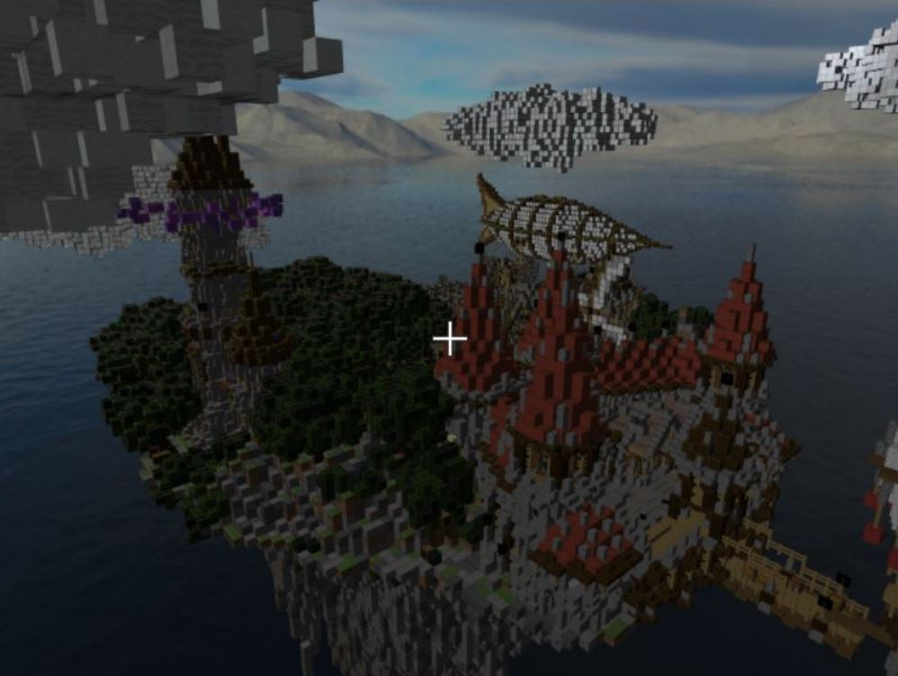

# CTUGL
## - WebGL rendering library
- CTUGL stands for Czech Technical University Graphics Library

   

   

    

## About
I created this library while I was working on my bachelor's thesis project. Because of the size and complexity of my project, it was necessary to extract
the general functionality out of the rest of the code and so the library originated.

The library consists of two parts. 

### 1) Base 
The first one contains only basic helper functions which can be used by other students while taking course of Computer Graphics programming.
There are no methods, which could hide some of the implementation details (and problems) of OpenGL / WebGL, so the students still have to understand the topic.
This part of library primarily focuses on unnecessary amount of code used for routine WebGL tasks, including shader linking & compilation, setting up textures etc.
The amount of code is substituted by simple method call, so several lines of code can be replaced by single one. This saves time and space.

*This is still Work in Progress and will be updated in the future.*

The base part of library is represented by single file - `ctugl.js`. It is based on the orignal **pgr-framework** library which is used by studets of CG programming course (https://cent.felk.cvut.cz/courses/PGR/).
Responsible person is Ing. Petr Felkel, Ph.D.; DCGI (felkepet@fel.cvut.cz). More info at https://dcgi.fel.cvut.cz/ .

### 2) Advanced
The rest of the library constists of classes which can be used while developing some more advanced 3D apps (games). It provides quite simple interface and freedom of usage. 
The user doesn't have to use all of the classes but only those he needs. For example Skybox, Cursor etc.
